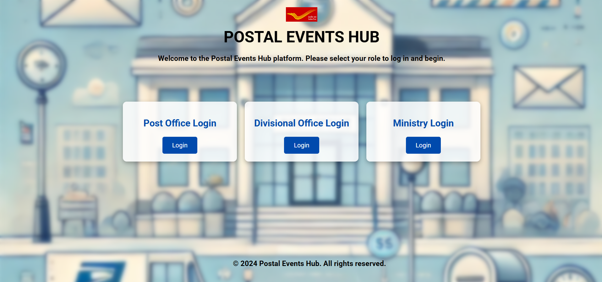
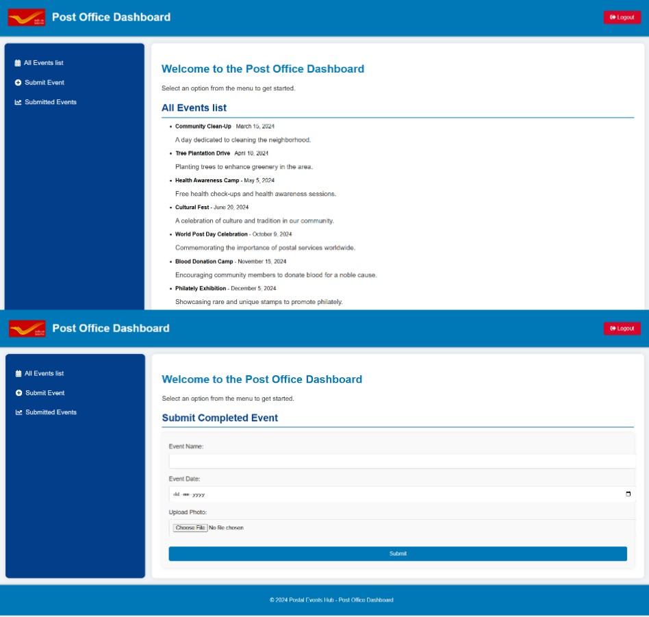
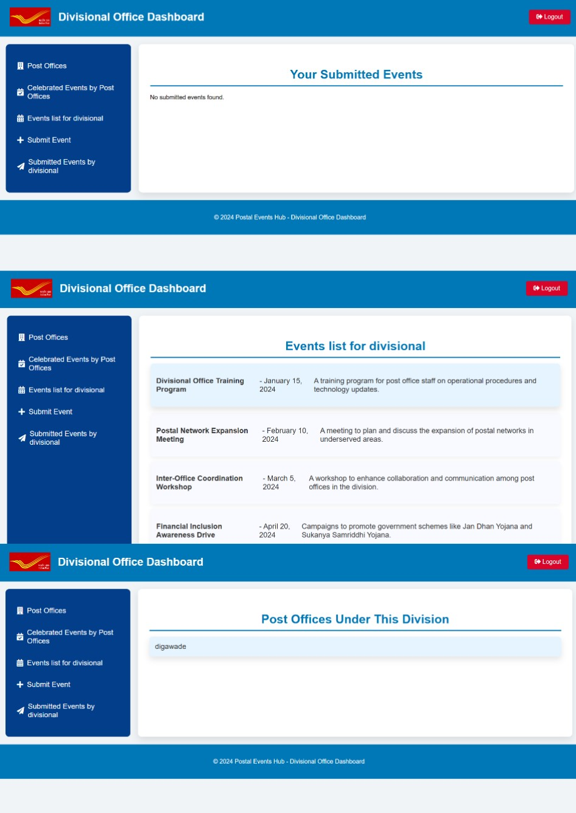
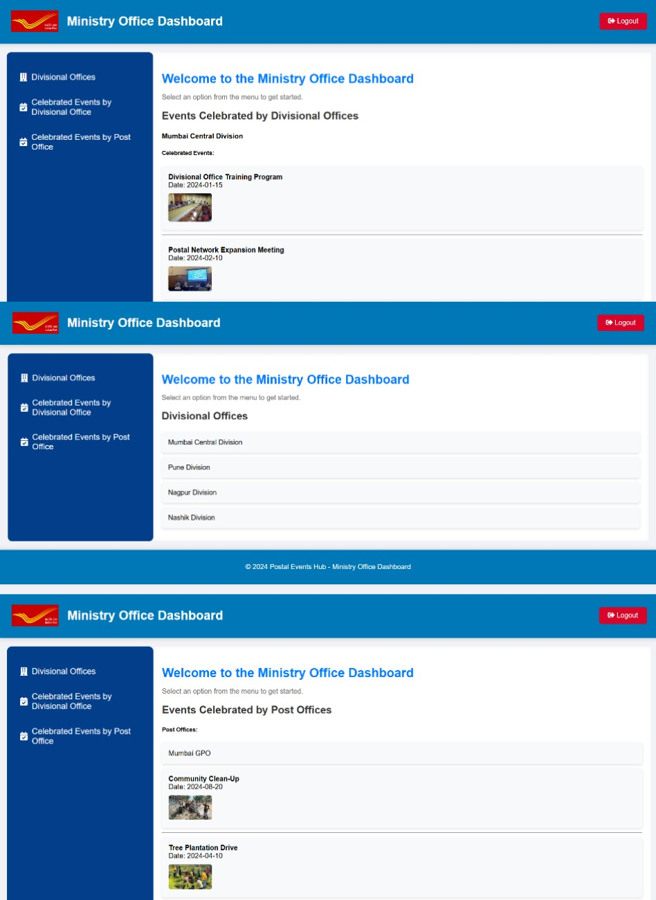

# 📊 Postal Events Hub

A centralized web-based dashboard developed to monitor **Swachhta (Cleanliness)** and **LiFE (Lifestyle for Environment)** initiatives across post offices in India.

---

## 🚀 Project Overview
**Postal Events Hub** provides an integrated digital platform to streamline reporting, monitoring, and management of cleanliness and environmental sustainability programs conducted by post offices.  
It introduces transparency, accountability, and efficiency at every administrative level — Post Office, Divisional Office, and Ministry.

---

## 💻 Tech Stack
- **Frontend:** HTML, CSS, JavaScript  
- **Backend:** PHP  
- **Database:** MySQL  

---

## 🧩 Key Features
✅ Role-based user authentication (Post Office, Division, Ministry)  
✅ Event submission with descriptions and image uploads  
✅ Centralized tracking and progress visualization  
✅ Real-time reporting and management  
✅ Secure login and data privacy  

---
## 🖼️ Project Screenshots

### 🔐 Login Page view

### 🏢 Post login view 

### 📝 divisional login view

### 🏣 Ministry login View

---

## 📈 Future Enhancements
- AI-based image verification for event validation  
- Real-time analytics dashboard  
- Integration with mobile app  
- Geolocation-based event visualization  

---

## 👥 Project Team
-Sounhard Powar 
- Priyanka Patil   
- Sanjana Nitnware  
- Karan Patil

---

## 🧑‍🏫 Guide
**Mrs. Bhagyashree Udagave**  
KIT’s College of Engineering (Autonomous), Kolhapur

---

## 🔗 LinkedIn Profile
[Sounhard Powar](https://www.linkedin.com/in/sounhard-powar)

---

## 🪪 License
Developed as part of the **Mini Project** for **B.Tech CSE (Semester 5)** at  
*KIT’s College of Engineering (Autonomous), Kolhapur.*

